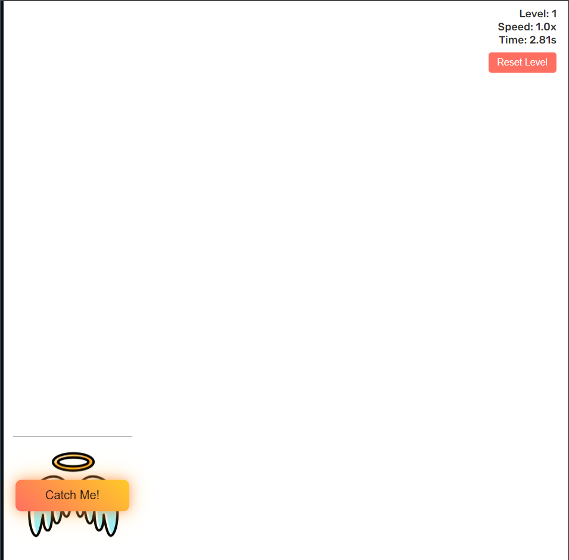

# ClickMe
Fleeing Button Fun 🏃‍♂️💨 This project features a mischievous button that just doesn't want to be clicked!
A fun and interactive fleeing button game where the goal is to catch the button as it tries to run away from your mouse. As you progress through levels, the game becomes increasingly difficult, with the button moving faster and farther away. 

## 🕹️ Demo

You can play the game live here: [Fleeing Button Game](https://darrengls.github.io/ClickMe)

## 🚀 Features

- **Dynamic Levels**: The button becomes more difficult to catch as levels increase.
- **Speed and Proximity Adjustments**: The button's speed and movement distance increase with each level.
- **Real-Time Timer**: Displays the time taken to complete each level.
- **Reset Button**: Allows restarting the game from level 1 at any time.
- **Responsive Design**: Works on different screen sizes and avoids getting stuck at screen corners.

## 🛠️ Installation

1. **Clone the repository:**
    ```bash
    git clone https://github.com/darrengls/ClickMe
    ```
2. **Navigate to the project directory:**
    ```bash
    cd fleeing-button-game
    ```
3. **Open `index.html` in your browser** to play the game locally.

## 📂 Project Structure

- `index.html`: Main HTML file with the game structure.
- `styles.css`: Contains the styles for the game.
- `script.js`: JavaScript file that controls the fleeing behavior, level progression, and timer.
- `wings.mp4`: animation video for the wings, unfortunatly it is an mp4.

## 📖 How to Play

1. Open the game link above or play locally by opening `index.html`.
2. Try to click on the fleeing button to advance to the next level.
3. Each level increases the button's speed and movement distance.
4. The timer shows how long it takes to complete each level.
5. Click the **Reset Level** button to restart the game at any time.

## 📝 Customization

You can modify the speed, proximity, and styling by adjusting the values in the `script.js` and `styles.css` files.

## ⚡ Technologies Used

- **HTML5**: For structuring the game layout.
- **CSS3**: For styling and responsiveness.
- **JavaScript**: For interactive game mechanics and level logic.
- **GSAP**: Used for smooth animations and movements of the button.

## 🔗 License

This project is open-source and available under the MIT License. Feel free to fork, modify, and use it in your projects.

---

Enjoy the game and challenge your friends to catch the fleeing button faster!


